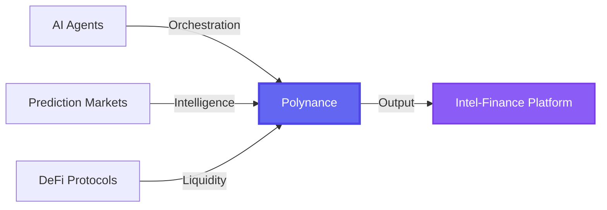
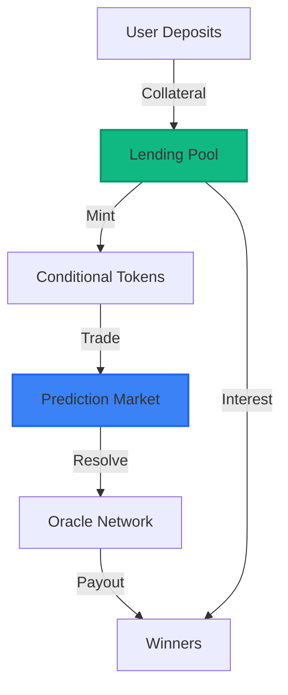
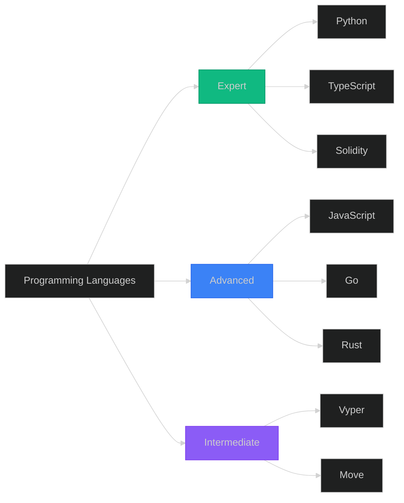
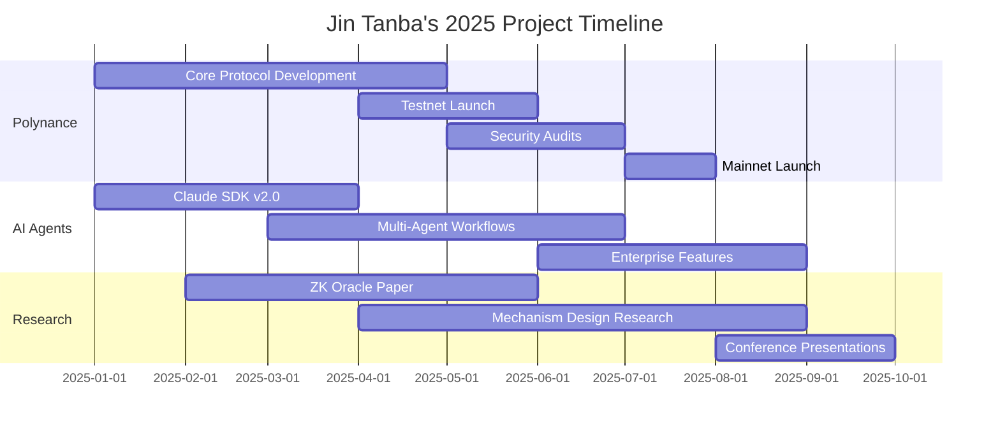

# Hi there, I'm Jin Tanba 👋

<div align="center">

<!-- Animated Header -->


[](https://twitter.com/InfoFinanceEth)
[](https://github.com/JinTanba)
[](https://jintanba.github.io/)
[](https://github.com/JinTanba)


</div>

---

## 🎯 Vision & Mission

> **"All prophecies are expressed in language. From this, we can create a prediction market."**

I'm building the **next generation of Intel-Finance** infrastructure — where **Artificial Intelligence**, **Decentralized Finance**, and **Collective Intelligence** converge to create transparent, trustless prediction markets powered by autonomous agents.

### 🌟 What I'm Working On



<div align="center">

| 🎯 Focus Area | 🚀 Technology | 📊 Status |
|:---:|:---:|:---:|
| **Polynance** | Prediction Markets + Lending | 🟢 Active Development |
| **Multi-Agent Systems** | Claude SDK + LangGraph | 🟢 Production |
| **Intel-Finance Tools** | AI + Blockchain Integration | 🟡 Research Phase |
| **Zero-Knowledge Proofs** | Privacy-Preserving Oracles | 🟡 Experimenting |

</div>

---

## 👨‍💻 About Me

**Full-Stack Engineer & Blockchain Architect** based in **Tokyo** 🗼

<table>
  <tr>
    <td width="50%" valign="top">
      
### 💼 Professional Identity

```typescript
interface JinTanba {
  role: "Engineer & Entrepreneur";
  location: "Tokyo, Japan" | "Global";
  timezone: "JST (UTC+9)";
  
  expertise: {
    aiAgents: ["Multi-Agent Systems", "LLM Orchestration", "Autonomous Workflows"],
    blockchain: ["Smart Contracts", "DeFi Protocols", "Oracles"],
    predictionMarkets: ["Market Design", "Liquidity Mechanisms", "Information Aggregation"]
  };
  
  currentProjects: [
    "Polynance: Prediction Market Infrastructure",
    "Claude Agent SDK: Multi-Agent Orchestration",
    "Intel-Finance: AI-Powered Market Intelligence"
  ];
  
  research: [
    "Advanced Agent Orchestration",
    "Zero-Knowledge Proofs for Oracles",
    "Decentralized AI Inference",
    "Mechanism Design for Prediction Markets"
  ];
}
```

</td>
<td width="50%" valign="top">

### 🧠 Core Philosophy

**Intel-Finance Thesis:**
- 🔮 **Prophecy → Markets**: Convert linguistic predictions into tradeable markets
- 🤖 **AI Agents**: Autonomous participants in prediction ecosystems
- 🌐 **Decentralization**: Trustless, censorship-resistant infrastructure
- 📊 **Collective Intelligence**: Harness wisdom of crowds through market mechanisms

**Technical Principles:**
- ⚡ **High Performance**: Optimized for speed and scalability
- 🔒 **Security First**: Audited smart contracts, secure key management
- 🧪 **Innovation**: Constantly experimenting with cutting-edge tech
- 🌍 **Open Source**: Building in public, contributing to ecosystem

</td>
</tr>
</table>

---

## 🚀 Featured Projects

### 🔮 Polynance Ecosystem

<details open>
<summary><b>🏗️ Core Infrastructure Projects</b> (Click to expand)</summary>

<br>

#### **1. [polyaave-dev](https://github.com/JinTanba/polyaave-dev)** ⭐2
> Revolutionary hybrid protocol combining prediction markets with lending

**Architecture:**


**Key Features:**
- 🏦 **Dual Utility**: Earn lending interest while participating in prediction markets
- 🔄 **Capital Efficiency**: Same collateral powers both systems
- ⚡ **Gas Optimized**: Custom Solidity implementations for minimal costs
- 🛡️ **Risk Management**: Isolated market pools with configurable parameters

**Tech Stack:** `Solidity` `Foundry` `OpenZeppelin` `Chainlink`

---

#### **2. [Polynance-Truemarket-Lens](https://github.com/JinTanba/Polynance-Truemarket-Lens)** ⭐2
> Multi-market aggregation layer providing unified liquidity and price discovery

**Features:**
- 📡 Aggregates data from Polymarket, Omen, Gnosis Conditional Tokens
- 🔄 Cross-market arbitrage detection
- 📊 Real-time price feeds and liquidity metrics
- 🎯 Smart order routing for best execution

**Architecture:**
```typescript
interface TruemarketLens {
  aggregateLiquidity(): Promise<LiquidityPool[]>;
  findArbitrage(): Promise<ArbitrageOpportunity[]>;
  getBestPrice(market: MarketId): Promise<PriceQuote>;
  routeOrder(order: Order): Promise<ExecutionPath>;
}
```

---

#### **3. [conditional-token-index](https://github.com/JinTanba/conditional-token-index)** ⭐2
> Advanced indexing and querying system for conditional tokens

**Capabilities:**
- 🗂️ **Fast Indexing**: Event-based indexing with sub-second latency
- 🔍 **Complex Queries**: GraphQL API for flexible data retrieval
- 📈 **Analytics**: Historical data, volume metrics, user behavior
- 🔗 **Multi-Chain**: Support for Polygon, Base, Ethereum mainnet

---

#### **4. [multioracle](https://github.com/JinTanba/multioracle)** ⭐2 🍴1
> Decentralized oracle system with multi-source verification

**Innovation:**
```solidity
// Multi-source consensus with confidence scoring
function resolveMarket(bytes32 marketId) external {
    DataPoint[] memory sources = fetchFromOracles();
    uint256 consensus = calculateWeightedConsensus(sources);
    uint256 confidence = computeConfidenceScore(sources);
    
    require(confidence >= CONFIDENCE_THRESHOLD, "Insufficient consensus");
    _finalizeMarket(marketId, consensus);
}
```

**Features:**
- 🎯 Multiple oracle sources (Chainlink, UMA, Custom)
- ⚖️ Weighted consensus algorithms
- 🛡️ Dispute resolution mechanisms
- 📊 Confidence scoring for reliability

</details>

---

### 🤖 AI Agent Development

<details open>
<summary><b>🧠 Multi-Agent Systems & Orchestration</b></summary>

<br>

#### **1. [claude-agent-sdk-python](https://github.com/JinTanba/claude-agent-sdk-python)** ⭐1
> Comprehensive Python SDK for building and orchestrating Claude-powered agent systems

**System Architecture:**
```
┌─────────────────────────────────────────────┐
│         Leader Agent (Orchestrator)         │
├─────────────────────────────────────────────┤
│  • Task Decomposition                       │
│  • Agent Spawning & Management              │
│  • Result Aggregation                       │
└───────────┬─────────────────────────────────┘
            │
    ┌───────┴────────┐
    ▼                ▼
┌─────────┐    ┌─────────┐    ┌─────────┐
│ Browser │    │ Creator │    │ Research│
│  Agent  │    │  Agent  │    │  Agent  │
└─────────┘    └─────────┘    └─────────┘
     │              │              │
     └──────────────┴──────────────┘
                    ▼
            ┌───────────────┐
            │ Unix Domain   │
            │   Sockets     │
            │   (IPC)       │
            └───────────────┘
```

**Key Capabilities:**
- 🎭 **Multi-Agent Orchestration**: Coordinate multiple specialized agents
- 🔄 **Async Communication**: Unix Domain Socket-based IPC
- 📊 **Workflow Automation**: Define complex multi-step workflows
- 🧪 **Testing Framework**: Built-in testing utilities for agent behavior

**Usage Example:**
```python
from claude_agent_sdk import LeaderAgent, spawn_agent

# Spawn specialized agents
browser = await spawn_agent("browser_agent")
creator = await spawn_agent("creator_agent")

# Orchestrate complex workflow
research_data = await browser.query("Research topic X")
content = await creator.query(f"Create article from: {research_data}")
```

---

#### **2. [aiagent_factory](https://github.com/JinTanba/aiagent_factory)** ⭐1
> Factory pattern implementation for creating configurable AI agents

**Design Pattern:**
```python
class AgentFactory:
    @staticmethod
    def create_agent(agent_type: AgentType, config: AgentConfig) -> Agent:
        """Factory method for agent instantiation"""
        
    def with_tools(self, tools: List[Tool]) -> AgentFactory:
        """Fluent interface for tool configuration"""
        
    def with_memory(self, memory: MemoryBackend) -> AgentFactory:
        """Configure agent memory system"""
```

---

#### **3. [sentence_match_llm](https://github.com/JinTanba/sentence_match_llm)** ⭐1
> Advanced semantic matching system for prediction market statements

**Use Case:** Match user queries to existing prediction markets using semantic understanding

```python
# Example: Finding similar prediction markets
query = "Will Bitcoin reach $100k by end of 2025?"
matches = sentence_matcher.find_similar_markets(
    query=query,
    threshold=0.85,
    limit=5
)
# Returns semantically similar markets even with different wording
```

</details>

---

### 🌐 MCP (Model Context Protocol) Integrations

<details>
<summary><b>🔌 Protocol Implementations</b></summary>

<br>

| Project | Description | Status |
|---------|-------------|--------|
| **[Polynance_mcp](https://github.com/JinTanba/Polynance_mcp)** | MCP server for Polynance API integration | ✅ Production |
| **[playwright-mcp](https://github.com/JinTanba/playwright-mcp)** | Browser automation via MCP protocol | ✅ Production |
| **[mcp-graphql](https://github.com/JinTanba/mcp-graphql)** | GraphQL query capabilities for MCP | 🚧 Beta |

**Why MCP?**
- 🔗 **Standardized Context**: Consistent way to provide context to LLMs
- 🔌 **Plugin Architecture**: Easy integration of new capabilities
- 🚀 **Scalable**: Works across multiple AI platforms

</details>

---

### 🛠️ Experimental & Research Projects

<details>
<summary><b>🧪 Innovation Lab</b></summary>

<br>

#### **[witch-and-Intel](https://github.com/JinTanba/witch-and-Intel)** 🍴1
**Concept:** Language-based prediction market where any statement can become a tradeable market

**Technical Innovation:**
- 🔮 Natural language → Market condition converter
- 🤖 AI-powered market resolution
- 🌐 Powered by Polynance infrastructure

---

#### **[fact-checker](https://github.com/JinTanba/fact-checker)**
**Real-time AI fact-checking for social media**

**Pipeline:**
```
Tweet/Post → Extract Claims → Check Against Sources → 
→ Confidence Score → Report Generation → User Notification
```

**Tech:** `LangChain` `OpenAI API` `Twitter API` `Vector DB`

---

#### **[zktls_llm_oracle](https://github.com/JinTanba/zktls_llm_oralce)** ⭐2
**Zero-Knowledge TLS proofs + LLM oracle system**

**Innovation:** Privacy-preserving oracle that proves data provenance without revealing source details

```typescript
// Concept: Prove "This data came from trusted source" 
// without revealing the source or full data
interface ZKTLSProof {
  dataHash: bytes32;
  sourceCommitment: bytes32;
  proof: SNARKProof;
  llmAttestation: Signature;
}
```

</details>

---

## 🛠️ Technical Expertise

### 💻 Languages & Proficiency

<div align="center">



</div>

<table>
  <tr>
    <td width="33%" align="center">
      
#### ⚡ Expert Level


</td>
<td width="33%" align="center">

#### 🚀 Advanced


</td>
<td width="33%" align="center">

#### 📚 Learning


</td>
</tr>
</table>

---

### 🎨 Frameworks & Libraries

<table>
  <tr>
    <th>Category</th>
    <th>Technologies</th>
    <th>Use Cases</th>
  </tr>
  <tr>
    <td><b>🌐 Web Frameworks</b></td>
    <td>
      
      
      
      
    </td>
    <td>Frontend applications, dApp interfaces</td>
  </tr>
  <tr>
    <td><b>🤖 AI/ML</b></td>
    <td>
      
      
      
      
    </td>
    <td>Multi-agent systems, LLM orchestration</td>
  </tr>
  <tr>
    <td><b>⛓️ Blockchain</b></td>
    <td>
      
      
      
      
    </td>
    <td>Smart contract development, testing, deployment</td>
  </tr>
  <tr>
    <td><b>🗄️ Databases</b></td>
    <td>
      
      
      
      
    </td>
    <td>Data persistence, caching, vector storage</td>
  </tr>
  <tr>
    <td><b>☁️ Infrastructure</b></td>
    <td>
      
      
      
      
    </td>
    <td>Deployment, scaling, monitoring</td>
  </tr>
</table>

---

### 🔧 Specializations Deep Dive

<details>
<summary><b>🤖 AI/ML Stack</b></summary>

<br>

**Multi-Agent Orchestration:**
- ✅ LangChain/LangGraph for agent workflows
- ✅ Claude AI for reasoning and decision-making
- ✅ DSPy for prompt optimization
- ✅ Custom agent frameworks (leader-worker pattern)

**Vector Databases & RAG:**
- Pinecone, Chroma, Weaviate
- Semantic search implementations
- Context retrieval for LLMs

**Model Fine-tuning:**
- LoRA/QLoRA for efficient fine-tuning
- Custom training pipelines
- Model evaluation frameworks

</details>

<details>
<summary><b>⛓️ Blockchain & DeFi</b></summary>

<br>

**Smart Contract Development:**
```solidity
// Example: Gas-optimized prediction market
contract OptimizedMarket {
    // Packed storage for minimal gas costs
    struct Market {
        uint96 outcomeTokens;  // Enough for most cases
        uint96 totalStake;
        uint32 resolutionTime;
        uint32 createdAt;
        bool resolved;
    }
    
    // Custom errors for gas savings
    error MarketNotResolved();
    error InsufficientBalance();
}
```

**Chains I Build On:**
- 🔹 **Ethereum**: Mainnet deployments, L2s
- 🟣 **Polygon**: High-throughput applications
- 🔵 **Base**: Next-gen Coinbase L2
- 🟢 **Gnosis**: Prediction market infrastructure

**DeFi Protocols:**
- AMMs (Uniswap, Curve mechanics)
- Lending (Aave, Compound forks)
- Oracles (Chainlink, UMA)
- Prediction Markets (Polymarket, Omen)

</details>

<details>
<summary><b>🌐 Web3 Infrastructure</b></summary>

<br>

**The Graph Protocol:**
- Custom subgraph development
- Complex entity relationships
- Real-time indexing strategies

**IPFS & Decentralized Storage:**
- NFT metadata management
- Decentralized application hosting
- Content addressing

**Wallet Integration:**
- WalletConnect, RainbowKit
- Account abstraction (ERC-4337)
- Multi-signature implementations

</details>

---

## 📊 GitHub Analytics

<div align="center">

### 📈 Contribution Overview


### 💻 Language Distribution


### 📊 Contribution Graph


</div>

---

## 🏆 Achievements & Metrics

<div align="center">

| Metric | Value | Description |
|:------:|:-----:|:------------|
| ⭐ **Total Stars** | 107+ | Across all repositories |
| 👥 **Followers** | 16+ | Growing community |
| 📦 **Public Repos** | 100+ | Open source contributions |
| 🔀 **Pull Requests** | 50+ | Collaborative work |
| 🎯 **Active Projects** | 10+ | Currently maintaining |

</div>

### 🎖️ GitHub Achievements

<div align="center">

| Achievement | Description | Status |
|-------------|-------------|--------|
| 🎯 **YOLO** | Merged PR without review | ✅ Unlocked |
| 👥 **Pair Extraordinaire** | Coauthored commits | ✅ Unlocked |
| ⚡ **Quickdraw** | Closed issue/PR quickly | ✅ Unlocked |
| 🦈 **Pull Shark x2** | Significant PRs opened | ✅ Unlocked |
| 🌟 **Starstruck** | Repository received stars | ✅ Unlocked |

</div>

---

## 🔬 Research Interests

<table>
  <tr>
    <td width="50%" valign="top">

### 🧠 Active Research Areas

**1. Mechanism Design for Prediction Markets**
- Optimal liquidity provisioning strategies
- Market maker algorithms (LMSR, LS-LMSR variants)
- Anti-manipulation mechanisms
- Incentive compatibility in decentralized systems

**2. Multi-Agent Systems**
- Agent communication protocols
- Coordination mechanisms
- Emergent behavior in agent societies
- Hierarchical task decomposition

**3. Zero-Knowledge Cryptography**
- ZK-SNARKs for oracle systems
- Privacy-preserving market participation
- Verifiable computation for AI inference

</td>
<td width="50%" valign="top">

### 📚 Publications & Writing

**Technical Blog Posts:**
- 📝 "Building Multi-Agent Systems with Claude" *(coming soon)*
- 📝 "Hybrid Prediction Markets: Polymarket meets Aave"
- 📝 "The Intel-Finance Thesis: AI + Crypto Convergence"

**Conference Talks:**
- 🎤 ETHGlobal Tokyo 2024 (Attendee)
- 🎤 AI × Crypto Meetup Tokyo (Speaker)

**Open Source Contributions:**
- Contributor to prediction market protocols
- Bug reports and improvements to DeFi projects
- Documentation for AI agent frameworks

</td>
</tr>
</table>

---

## 🎓 Learning & Development

### 📖 Currently Learning

```python
current_learning = {
    "advanced_topics": [
        "Advanced Agent Orchestration Patterns",
        "Zero-Knowledge Proof Systems (Circom, Noir)",
        "MEV and Transaction Ordering",
        "Decentralized AI Inference Networks"
    ],
    
    "new_technologies": [
        "Rust for high-performance blockchain",
        "Move programming language (Sui, Aptos)",
        "zkML (Zero-Knowledge Machine Learning)",
        "Account Abstraction (ERC-4337)"
    ],
    
    "business_skills": [
        "Tokenomics and mechanism design",
        "Community building and governance",
        "Technical writing and documentation",
        "Open source project management"
    ]
}
```

### 🎯 2025 Goals

- [ ] 🚀 Launch Polynance v1 on mainnet
- [ ] 📚 Publish 5+ technical blog posts
- [ ] 🤝 Collaborate with 10+ open source projects
- [ ] 🎤 Speak at 2+ blockchain/AI conferences
- [ ] ⭐ Reach 250+ GitHub stars across projects
- [ ] 🏆 Win a hackathon grand prize
- [ ] 📖 Complete ZK certification course
- [ ] 🌟 Build a project with 1000+ active users

---

## 🤝 Collaboration & Open Source

### 🌟 Looking to Collaborate On

<div align="center">

| Area | Interests | Availability |
|------|-----------|--------------|
| 🔮 **Prediction Markets** | Novel market mechanisms, liquidity strategies | 🟢 Open |
| 🤖 **AI Agents** | Multi-agent systems, LLM orchestration | 🟢 Open |
| ⛓️ **DeFi Protocols** | Lending, AMMs, yield optimization | 🟡 Selective |
| 🔬 **Research** | Academic collaborations, whitepapers | 🟢 Open |
| 🎓 **Education** | Tutorials, workshops, mentorship | 🟢 Open |

</div>

### 💡 How to Contribute

**To My Projects:**
1. 🐛 Report bugs or suggest features via GitHub Issues
2. 🔀 Submit pull requests (check CONTRIBUTING.md)
3. 💬 Join discussions in Discussions tab
4. ⭐ Star repositories you find useful
5. 📢 Share projects with your network

**Collaboration Guidelines:**
- ✅ Clear communication and documentation
- ✅ Test-driven development approach
- ✅ Code review and feedback welcome
- ✅ Open to pair programming sessions

---

## 📫 Connect With Me

<div align="center">

### 🌐 Social & Professional Links

[](https://twitter.com/InfoFinanceEth)
[](https://github.com/JinTanba)
[](https://jintanba.github.io/)
[](https://linkedin.com/in/jintanba)

### 💬 Preferred Communication

| Platform | Response Time | Best For |
|----------|--------------|----------|
| 🐦 **Twitter DM** | ~24 hours | Quick questions, networking |
| 💼 **GitHub Issues** | ~48 hours | Technical discussions, bugs |
| 📧 **Email** | ~3 days | Formal inquiries, partnerships |
| 💬 **Discord** | Variable | Community discussions |

### 📧 Email Topics Welcome

- 🤝 **Collaboration opportunities** on AI/Crypto projects
- 💼 **Consulting** for prediction market or agent systems
- 🎤 **Speaking engagements** at conferences/meetups
- 🎓 **Mentorship requests** (limited availability)
- 🔬 **Research collaborations** in Intel-Finance

</div>

---

## 🌟 Fun Facts & Personality

<table>
  <tr>
    <td width="50%" valign="top">

### 🎨 Beyond Code

- 🗼 **Location:** Tokyo, but thinking globally
- 🌙 **Work Style:** Night owl, deep work sessions
- ☕ **Fuel:** Coffee + electronic music
- 🎮 **Hobbies:** Strategy games, philosophy, sci-fi
- 📚 **Reading:** Mechanism design, cyberpunk novels
- 🎬 **Inspiration:** Ghost in the Shell, Matrix, Westworld

</td>
<td width="50%" valign="top">

### 💭 Philosophical Musings

> **On Prediction Markets:**  
> "Every statement about the future is a bet. We're just making the betting explicit and the odds transparent."

> **On AI Agents:**  
> "The future isn't AI replacing humans—it's AI agents and humans collaborating in ways we haven't imagined yet."

> **On Open Source:**  
> "Code is poetry that compiles. Share it freely and watch communities build cathedrals."

</td>
</tr>
</table>

### 🎯 Personal Principles

1. **🔓 Build in Public:** Share learnings, failures, and successes
2. **🧪 Experiment Fearlessly:** Innovation requires taking calculated risks
3. **🤝 Collaborate Generously:** Best ideas emerge from collective intelligence
4. **📚 Learn Continuously:** Technology evolves; so should we
5. **🌍 Think Globally:** Solutions should work for everyone, everywhere

---

## 📈 Project Roadmap 2025



---

## 🎁 Support My Work

If you find my projects valuable, consider:

<div align="center">

⭐ **Star my repositories** - It helps with visibility!  
🔀 **Fork and contribute** - Open source thrives on collaboration  
🐦 **Share on social media** - Help others discover useful tools  
💬 **Provide feedback** - Your insights make projects better  
☕ **Buy me a coffee** - Fuel more late-night coding sessions  

[](https://github.com/sponsors/JinTanba)

</div>

---

## 📊 Detailed Stats

<div align="center">

### 🔥 Recent Activity

<!--START_SECTION:activity-->
<!--END_SECTION:activity-->

### 📅 Coding Time (This Week)

<!--START_SECTION:waka-->
<!--END_SECTION:waka-->


</div>

---

<div align="center">

## 💬 Let's Build the Future Together

**I'm always open to interesting conversations and collaborations.**

Whether you're working on prediction markets, AI agents, DeFi protocols, or just want to chat about the future of Intel-Finance—**let's connect!**


### ⚡ *"In code we trust, in markets we verify."* ⚡

**Last Updated:** January 2025

</div>